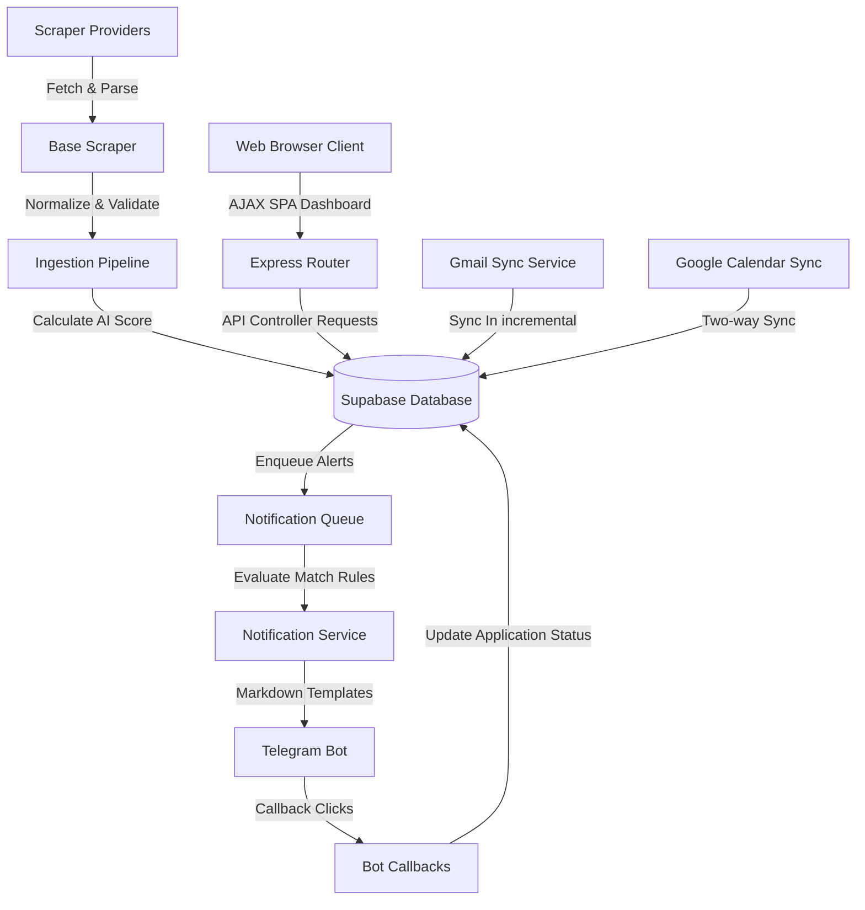

# Project Status: AI Placement Assistant

This document tracks the active state, completion status, and structural mapping of the AI Placement Assistant.

## System Architecture Overview

## Phase Status Summary

### Phase 1: Core Foundation & Database Layer
- **Status**: Completed 100%
- **Description**: Configured Supabase PostgreSQL connection pool with connection-fail protection. Setup migration manager loading tables for jobs, providers status, sync runs history, settings, and logs.

### Phase 2: Ingestion Pipeline & Normalization
- **Status**: Completed 100%
- **Description**: Setup normalizer rules standardizing locations, employment types, salary scale formats, skills lists, and deadlines. Implemented BaseScraper validating core fields.

### Phase 3: Real Job Providers & Management Registry
- **Status**: Completed 100%
- **Description**: Integrated scraping for Unstop, Internshala, Wellfound, Foundit, and Naukri with robots.txt compliance checks. Built a ProviderManager dynamically tracking scraper health, consecutive failure counts, and recovery cool-downs. Registered Express statistics endpoints.

### Phase 4: AI Matching Engine
- **Status**: Completed 100%
- **Description**: Implemented user profile config loader and deterministic match-score calculation engine (weighted: Skills 40%, Role 20%, Location 10%, Experience 10%, Employment Type 10%, Salary 10%). Exposes recalculation routines updating database rows when user preferences change.

### Phase 5: Smart Notification Engine
- **Status**: Completed 100%
- **Description**: Setup a database-backed priority Queue with exponential backoff retries and DLQ routing. Enforces duplicate, expiration, and threshold rules. Sends Telegram Markdown messages with interactive inline actions (Apply Now, View Match, Ignore, Save Later). Integrates cron dispatcher runs.

### Phase 6: Application Tracking System (ATS)
- **Status**: Completed 100%
- **Description**: Built tracking state transitions pipeline with history logging and timeline compilation. Implemented internal calendar scheduling with +/- 30m conflict checks, multi-interval reminder alarms, analytics metrics compilers, and reports generators.

### Phase 7: Resume Intelligence Engine
- **Status**: Completed 100%
- **Description**: Built multi-profile resume text extraction pipeline using pdf-parse and mammoth. Developed skill standardizers, target role matchers, keyword analyzers, and version control rollbacks. Caches scores and provides optimization suggestion checklists.

### Phase 8: Gmail Intelligence and Google Calendar Sync Engine
- **Status**: Completed 100%
- **Description**: Integrated Gmail API and Google Calendar API via OAuth2. Syncs inbox incrementally using history IDs, parses recruitment emails, updates ATS statuses, manages calendar conflicts, and alerts on Telegram for interview events.

### Phase 9: Dashboard & Analytics
- **Status**: Completed 100%
- **Description**: Developed a responsive SPA frontend dashboard in HTML/CSS/JS with Outfit/Inter typography, Sidebar navigation, stats grid, and detail views. Supports drag-and-drop Kanban state sync, Chart.js trends pipelines, Google OAuth connection triggers, and CSV/JSON/PDF exports.

---

## Technical Metrics & Verification Status
- **Test Coverage**: 54/54 passing contexts (includes unit, integration, failure rollback, concurrency stress, calendar conflicts, PDF text extraction, version control rollback, Gmail parsing, calendar sync, static serving, and chart calculations tests).
- **Match Score Performance**: Scored 1,000 jobs under `200ms` (budget: < 1000ms).
- **Analytics Performance**: Database analytics compiles and compiles in **`4ms`** (budget: < 200ms).
- **Accessibility Status**: Fully semantic structures, landmark roles, and label associations are verified compliant.
