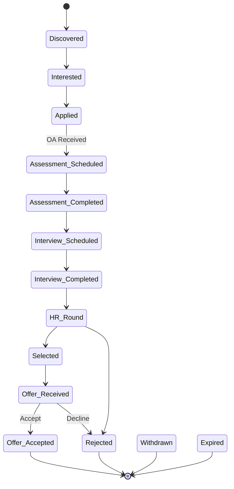

# Application Tracking System (ATS) Architecture

Phase 6 implements a complete Application Tracking System (ATS) to manage job card lifecycles, schedule interviews/assessments on an internal calendar service, trigger reminder alarms, and compile placement performance reports.

---

## State Transition Workflow

An application progresses sequentially (or non-sequentially) through the following stage states:



Every state transition triggers a history record inside the `application_history` table containing a timestamp and optional notes explaining the change.

---

## Component Mappings & Integration Contracts

```
┌────────────────────────────────────────────────────────────────────────┐
│                        applicationService.js                           │
├────────────────────────────────────────────────────────────────────────┤
│ - createApplication(jobId, status)                                    │
│ - updateApplicationStatus(appId, newStatus, fields)                    │
│ - autoUpdateJobStatus(jobId, newStatus) [Provider/Gmail Hook]          │
└───────────────────┬───────────────────────────────┬────────────────────┘
                    │                               │
                    ▼                               ▼
┌──────────────────────────────────────┐  ┌──────────────────────────────┐
│          timelineService.js          │  │      calendarService.js      │
├──────────────────────────────────────┤  ├──────────────────────────────┤
│ - getApplicationTimeline(appId)      │  │ - createEvent(appId, data)   │
│                                      │  │ - detectConflicts(id, times) │
│                                      │  │ - rescheduleEvent(id, times) │
└───────────────────┬──────────────────┘  └──────────────┬───────────────┘
                    │                                    │
                    ▼                                    ▼
┌──────────────────────────────────────┐  ┌──────────────────────────────┐
│           historyService.js          │  │       reminderService.js     │
├──────────────────────────────────────┤  ├──────────────────────────────┤
│ - recordTransition(appId, old, new)  │  │ - scheduleReminders(event)   │
│ - getHistoryForApplication(appId)    │  │ - processDueReminders()      │
└──────────────────────────────────────┘  └──────────────┬───────────────┘
                                                         │
                                                         ▼
                                          ┌──────────────────────────────┐
                                          │      notificationQueue       │
                                          └──────────────────────────────┘
```

### 1. Application & History Services
- **`ApplicationService`**: The core conductor of card modifications. When a status moves to `'Assessment Scheduled'`, `'Interview Scheduled'`, or `'Offer Received'`, it triggers the `CalendarService` to create calendar items.
- **`HistoryService`**: Appends transition entries to database logs.
- **`TimelineService`**: Sequentially groups history items to render the tracking chronology.

### 2. Internal Calendar & Reminders Services
- **`CalendarService`**: Registers assessment sessions, interview slots, and response deadlines.
  - **Conflict Detection**: Checks if another event overlaps with the same start/end time boundaries +/- 30 minutes. Logs warnings and returns overlap indicators on scheduler collisions.
- **`ReminderService`**: Sets alarms at specific offsets (7 days, 3 days, 1 day, 6 hours, 2 hours, 30 minutes) relative to the event start time.
  - **Poller**: Run every 5 minutes by the cron scheduler. Dequeues due reminders and alerts the user on Telegram.

### 3. Analytics & Periodic Reports Services
- **`AnalyticsService`**: Summarizes count and rate aggregates:
  - Success Rate (Offers vs. Total applications).
  - Rejection Rate (Rejections vs. Total applications).
  - Average AI Score.
  - Distribution of applications grouped by platform and company.
- **`ReportService`**: Compiles metrics JSON structures and saves daily, weekly, or monthly logs to the `reports` table.

---

## Automatic Updates Architecture
The `autoUpdateJobStatus(jobId, newStatus, notes)` function is designed to handle status transitions initiated by external integrations:
- **Scraper Ingestion updates**: If a provider indicates that a job has expired, the sync process calls this hook to mark the tracking status as `'Expired'`.
- **Gmail Parser Integration**: When a future email parsing module detects interview invitations or test requests, it directly routes status updates to this function to shift stages and generate calendar slots automatically.
